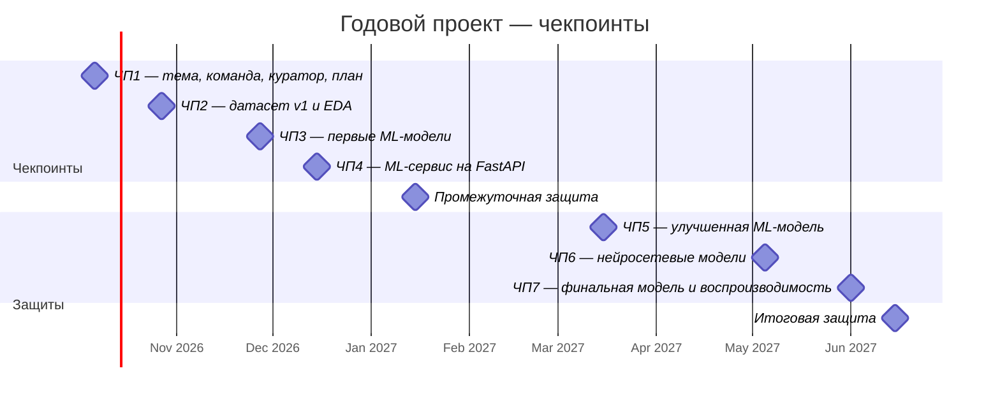

<div align="center">

# 📈 Предсказание движения цен на фьючерсы на основе текстовых данных

**Годовой проект магистратуры ФКН НИУ ВШЭ**


</div>

---

## 📌 О проекте

Проект посвящён не-TA-трейдингу, то есть прогнозированию движения цен на фьючерсы по текстовым данным.

Готового датасета нет, поэтому данные собираются самостоятельно из новостных API, форумов и социальных сетей.

Исследуются два направления:

| Направление | Вопрос |
|---|---|
| 🆚 **Тех. анализ vs новости** | Даёт ли анализ новостей прирост качества по сравнению с классическим техническим анализом |
| 📰 **Новости vs соцсети** | Чем отличается предсказательная сила структурированных новостей и неструктурированных текстов |


---

## 👥 Команда

| Роль | Участник | GitHub |
|---|---|---|
| 🎓 Куратор | **Алкаев Владислав Алексеевич** | [@Avvonna](https://github.com/Avvonna) |
| 👤 Участник | **Евдакушин Илья Сергеевич** | [@isevdakushin](https://github.com/isevdakushin) |
| 👤 Участник | **Федосов Артем Александрович** | [@fffedosofff](https://github.com/fffedosofff) |
| 👤 Участник | **Коренков Александр Андреевич** | [@makkkel](https://github.com/makkkel) |
---

## 🗺️ План работы

### Чекпоинты

| № | Дата | Содержание | Статус |
|---|---:|---|:-:|
| ЧП1 | 6 окт | Тема, команда, куратор и план работы в README | [x] |
| 1.1 | 11 окт | Окончательно выбраны инструменты, горизонт и источники, проверены доступы к API. Котировки скачаны, контракты склеены, таргет определён | [ ] |
| 1.2 | 18 окт | Парсер основного новостного источника работает, сырые данные собраны за весь период. Тексты с таймстемпами в UTC выровнены с котировками | [ ] |
| 1.3 | 24 окт | Черновик EDA: баланс таргета, объём текстов во времени, дубли, связь числа новостей с волатильностью. Описание датасета | [ ] |
| ЧП2 | 27 окт | Датасет v1 и EDA с выводами. Сбор соцсетей продолжается в фоне | [ ] |
| 2.1 | 8 ноя | Схема валидации (walk-forward), метрики, бейзлайны: константа и модель на ТА-индикаторах. MLflow поднят | [ ] |
| 2.2 | 15 ноя | 2–3 пайплайна предобработки, BoW/TF-IDF, линейные модели на новостях | [ ] |
| 2.3 | 22 ноя | word2vec/fastText, модель «ТА + новости», подбор гиперпараметров | [ ] |
| ЧП3 | 27 ноя | Первые ML-модели, сравнение «ТА против ТА + новости», выводы | [ ] |
| 3.1 | 6 дек | FastAPI: `/predict` и `/health`, Pydantic-схемы, загрузка модели из артефакта | [ ] |
| 3.2 | 13 дек | Docker, базовые тесты, инструкция по запуску. Telegram-бот — по желанию | [ ] |
| ЧП4 | 15 дек | ML-сервис на FastAPI с лучшей моделью | [ ] |
| 4.1 | 27 дек | Структура презентации и ключевые графики | [ ] |
| 4.2 | 8 янв | Прогон доклада | [ ] |
| ПЗ | 10–15 янв | Промежуточная защита | [ ] |
| 4.3 | 7 фев | Данные соцсетей за тот же период выровнены, EDA по ним | [ ] |
| 4.4 | 21 фев | Бустинги и новые признаки: тональность, агрегаты по окну, объём упоминаний | [ ] |
| 4.5 | 7 мар | Сравнение «новости / соцсети / вместе» с проверкой значимости | [ ] |
| ЧП5 | 15 мар | Улучшенная ML-модель, сравнение новостей и соцсетей, выводы | [ ] |
| 5.1 | 29 мар | Замороженные трансформерные эмбеддинги и классификатор поверх них | [ ] |
| 5.2 | 12 апр | Дообучение трансформера | [ ] |
| 5.3 | 26 апр | Сравнение DL с ML | [ ] |
| ЧП6 | 5 мая | Нейросетевые модели и сравнение с ML-подходами | [ ] |
| 6.1 | 17 мая | Воспроизводимый пайплайн от сырых данных до модели; лучшая модель переобучена и залогирована в MLflow | [ ] |
| 6.2 | 31 мая | Анализ ошибок и устойчивости, лучшая модель подключена к сервису | [ ] |
| ЧП7 | Начало июня | MLflow и воспроизводимость экспериментов, финальная модель с артефактами, анализ ошибок и устойчивости | [ ] |
| 7.1 | 6 июн | Черновик итоговой презентации | [ ] |
| 7.2 | 10 июн | Прогон доклада | [ ] |
| ИЗ | 13–20 июн | Итоговая защита | [ ] |

### Таймлайн



## 🗂️ Структура репозитория

```
├── README.md
```

---

<div align="center">

НИУ ВШЭ · Факультет компьютерных наук · 2026-2027

</div>
