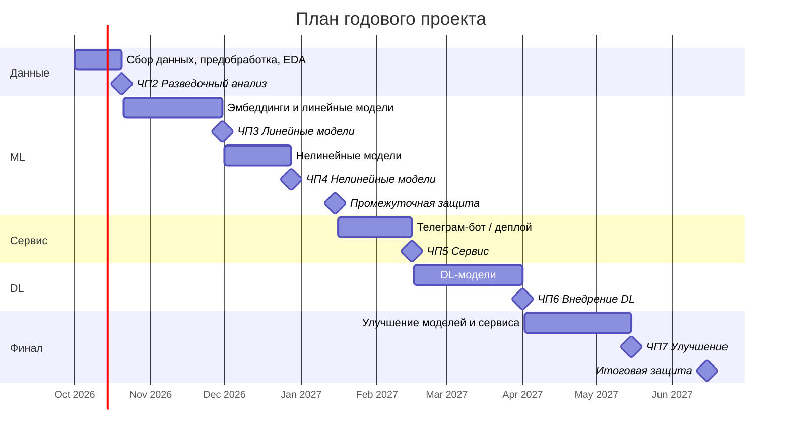

<div align="center">

# 📈 Предсказание движения цен на фьючерсы на основе текстовых данных

**Годовой проект магистратуры ФКН НИУ ВШЭ**


</div>

---

## 📌 О проекте

Проект посвящён не-TA-трейдингу, то есть прогнозированию движения цен на фьючерсы по текстовым данным, а не только по ценовым рядам.

Готового датасета нет, поэтому данные собираются самостоятельно из новостных API, форумов и социальных сетей.

Исследуются два направления:

| Направление | Вопрос |
|---|---|
| 🆚 **Тех. анализ vs новости** | Даёт ли анализ новостей прирост качества по сравнению с классическим техническим анализом |
| 📰 **Новости vs соцсети** | Чем отличается предсказательная сила структурированных новостей и неструктурированных текстов (Twitter/X, Reddit) |

**Уровень:** base / middle

---

## 👥 Команда

| Роль | Участник | GitHub |
|---|---|---|
| 🎓 Куратор | **Алкаев Владислав** | - |
| 👤 Участник | **Евдакушин Илья Сергеевич** | [@isevdakushin](https://github.com/isevdakushin) |
| 👤 Участник | **Федосов Артем Александрович** | [@fffedosofff](https://github.com/fffedosofff) |
| 👤 Участник | **Александр** | [@username](https://github.com/username) |

---

## 🗺️ План работы

### Чекпоинты

| № | Чекпоинт | Что делаем по проекту | Срок | Статус |
|---|---|---|---|---|
| 1 | 🧭 **Установочный** | Тема, команда, куратор, репозиторий, план работы | конец сентября 2026 | 🟡 |
| 2 | 🔎 **Разведочный анализ** | Сбор данных (новостные API, парсинг форумов и соцсетей, котировки фьючерсов), предобработка текстов, разметка таргета, EDA | ~20 октября 2026 | ⬜ |
| 3 | 📏 **Линейные ML-модели** | Эмбеддинги (BoW/TF-IDF, word2vec/fastText), бейзлайн на тех. анализе, линейные классификаторы | конец ноября 2026 | ⬜ |
| 4 | 🌳 **Нелинейные ML-модели** | Бустинги и другие нелинейные модели, сравнение новостей и соцсетей, сравнение с тех. анализом | конец декабря 2026 | ⬜ |
| - | 🎤 **Промежуточная защита** | Презентация результатов первого полугодия | середина января 2027 | ⬜ |
| 5 | 🚀 **Сервис** | Телеграм-бот с лучшей ML-моделью, при возможности деплой в Kubernetes | середина февраля 2027 | ⬜ |
| 6 | 🧠 **Внедрение DL** | Трансформерные эмбеддинги, дообучение трансформеров, нейросетевые классификаторы | конец марта - начало апреля 2027 | ⬜ |
| 7 | 🛠️ **Улучшение моделей и сервиса** | Тюнинг моделей, подключение DL-модели к сервису, доработка сервиса | середина мая 2027 | ⬜ |
| - | 🏁 **Защита** | Итоговый отчёт и финальная защита проекта | июнь 2027 | ⬜ |

### Таймлайн



### Чек-лист

- [x] Выбрать тему и заполнить форму
- [ ] Создать репозиторий и описать план работы
- [ ] Выбрать фьючерсы и горизонт прогноза
- [ ] Определить источники новостей и соцсетей, получить доступы к API
- [ ] Собрать сырой датасет и провести EDA
- [ ] Реализовать несколько пайплайнов предобработки текста
- [ ] Построить бейзлайн на техническом анализе
- [ ] Сравнить методы эмбеддингов на линейных моделях
- [ ] Обучить и сравнить нелинейные ML-модели
- [ ] Подготовить промежуточную защиту
- [ ] Обернуть лучшую ML-модель в сервис
- [ ] Обучить и сравнить DL-модели
- [ ] Улучшить модели и подключить лучшую к сервису
- [ ] Подготовить итоговый отчёт и презентацию

---

## 🗂️ Структура репозитория

```
├── data/               # сырые и обработанные данные (не коммитятся)
├── notebooks/          # EDA и эксперименты
├── src/
│   ├── parsing/        # сбор данных из API, форумов, соцсетей
│   ├── preprocessing/  # обработка текстов
│   ├── features/       # эмбеддинги и признаки
│   ├── models/         # ML и DL модели
│   └── service/        # телеграм-бот / API сервиса
├── reports/            # отчёты по чекпоинтам
├── requirements.txt
└── README.md
```

---

<div align="center">

НИУ ВШЭ · Факультет компьютерных наук · 2026-2027

</div>
